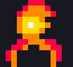
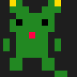
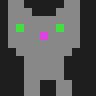
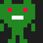
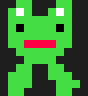

# Buddies

**The game layer for Claude Code.** Collect, evolve, and play with AI companions in your terminal.

<p align="center">
  
</p>

[](https://www.python.org/downloads/)
[](LICENSE)
[](#species--rarity)
[](#hats-16)
[](#games-arcade-10-games)
[](#achievements)
[](#)

## Claude Code has a /buddy. We have the game.

Claude Code's built-in companion is a cute mascot that watches you code. Buddies is everything beyond that: **70+ collectible species**, a **10-game arcade** (including a deckbuilder, Snake, and Ski Free), a **full text adventure MUD**, **buddy fusion**, **personality drift**, a **retro BBS**, and **async multiplayer** — all running alongside your coding sessions with zero token cost.

You can even **import your CC /buddy companion** into your Buddies party. Claude bridges the two systems automatically — your CC mushroom can sit at the poker table with your Phoenix.

## Why

Half the time Claude Code is burning tokens just figuring out where things are in your project. Buddies fixes that — it auto-generates a code map, grades your CLAUDE.md, watches for repeated mistakes and writes rules so Claude stops making them, and tracks your token usage with early warnings before you hit context limits.

It also happens to be a collectible creature game with 70 species, 10 arcade games, a full text adventure MUD, a retro BBS social network, and personality-driven commentary. Because productivity tools should be fun.

## Quick Start

```bash
cd buddies && pip install -e .    # Install
buddy                              # Launch
python -m buddies.setup_hooks      # Watch Claude Code sessions (one-time)
```

<details>
<summary><strong>Set up local AI (recommended)</strong></summary>

Install [Ollama](https://ollama.com), pull a model, then edit `%APPDATA%/buddy/config.json` (or `~/.local/share/buddy/config.json` on Linux):

```json
{
  "ai_backend": {
    "provider": "ollama",
    "base_url": "http://localhost:11434",
    "model": "llama3.2:3b"
  }
}
```

With a local model, your buddy can answer coding questions, read files, search code, and run safe commands — all routed automatically by complexity. For Ollama on another machine, use `http://<home-ip>:11434`.

</details>

<details>
<summary><strong>Register MCP tools for Claude (optional)</strong></summary>

```bash
python -m buddies.setup_mcp
```

Gives Claude access to: `buddy_status`, `buddy_note`, `session_stats`, `ask_buddy`, `get_buddy_notes`, `import_cc_buddy`, `detect_cc_companion`

The `import_cc_buddy` tool lets Claude bring your CC /buddy companion into the Buddies party. `detect_cc_companion` auto-detects from config files. You can also set a manual override in your Buddies `config.json` under the `cc_buddy` key.

</details>

<details>
<summary><strong>Claude Desktop / headless mode</strong></summary>

Run Buddy as a pure MCP server without the TUI:

```bash
buddy --headless
```

Add to Claude Desktop's `claude_desktop_config.json`:

```json
{
  "mcpServers": {
    "buddies": {
      "command": "buddy",
      "args": ["--headless"]
    }
  }
}
```

All 5 MCP tools work in headless mode. Background services (session observer, code map refresh) run alongside.

</details>

## Features

### The Useful Stuff

| Feature | What it does |
|---------|-------------|
| **Code structure map** | Auto-generates `project-map.md` in `.claude/rules/` — Claude skips exploration, saves tokens. Refresh with [F3]. |
| **Config intelligence** | Grades your CLAUDE.md health (A-F), scaffolds `.claude/rules/`, auto-learns rules from repeated corrections. |
| **Token guardian** | Rolling session summaries, early warnings at 50/70/90% context, quick-save [F1], session handoff files. |
| **Smart model router** | Displays current CC model, detects work phase (planning/implementing/exploring), suggests cheaper models when appropriate. |
| **Session awareness** | Watches Claude Code activity via hooks, detects patterns, suggests config rules. |
| **Layered prompt assembly** | Composable system prompts from identity + personality + memory + context + task layers. |
| **Three-tier memory** | Episodic/semantic/procedural memory with contradiction detection. Keyword recall across tiers. |
| **Agentic local AI** | Connected to Ollama, buddy reads files, greps code, runs safe commands — all sandboxed. |

### The Fun Stuff

| Feature | What it does |
|---------|-------------|
| **70 species** | Common Potato to Legendary Zorak. Deterministic gacha — same username, same starter. |
| **10 arcade games** | Snake, Ski Free, Deckbuilder, Hold'em, Whist, Pong, Trivia, Blobber CRPG, StackHaven MUD, and StackWars 4X. |
| **StackHaven MUD** | 24-room text adventure with save/load, NPCs, quests, combat, Dark Souls multiplayer, and discoverable lore. |
| **SMT-style negotiation** | Talk your way through MUD encounters. Bugs ask tech-themed questions; your answers determine the outcome. |
| **Async multiplayer** | Soapstone notes, bloodstains, and phantom traces sync via GitHub Issues. See other adventurers' journeys. |
| **BBS social network** | Retro bulletin board with 7 boards. Buddies auto-browse and post. GitHub Issues transport. |
| **Personality drift** | Stats evolve from how you play — games, chat, idle time all cause stat shifts. |
| **Buddy relationships** | Buddies develop opinions about each other. Stranger to best friend (or rival to nemesis). |
| **Buddy fusion** | Sacrifice two buddies to create something new. 12 special recipes, fusion-exclusive species, Chimera Crown hat. Fusion codex tracks discoveries. |
| **Idle life** | Buddies do things while you code — explore, find items, journal, get into trouble, socialize. |
| **16 hats** | Unlocked by playstyle, stats, milestones, and even boredom. |
| **4 evolution stages** | Hatchling, Juvenile, Adult, Elder — with visual border changes. |
| **63 achievements** | Collection, mastery, social, exploration, games, MUD, and secret categories. |
| **CC /buddy import** | Bring your Claude Code companion into the party via MCP, auto-detect from config, or manual override. Plays games, joins discussions, appears in MUD. |
| **6 themes** | Default, midnight, forest, ocean, sunset, light — cycle with [F2]. |
| **Prose engine** | Each buddy speaks through a personality register (clinical, sarcastic, absurdist, philosophical, calm). Zero AI needed. |

### Games Arcade (10 games)

<p>
  
</p>

| Game | Style | What makes it fun |
|------|-------|-------------------|
| **Buffer Overflow** | Snake | StackHaven-themed: speed boosts, multiplier zones, firewall obstacles, garbage collectors |
| **Stack Descent** | Ski Free | Dodge legacy code blocks skiing downhill. The Auditor (the yeti) chases you after 15 seconds. |
| **Deploy or Die** | Deckbuilder | Survive 7 sprints of production hell. ~30 cards, 15 incident types. Designed with [wargame book](https://github.com/lerugray/wargame-design-book) principles. |
| **Texas Hold'em** | Poker | ASCII table with buddy profile pics at seats |
| **Whist** | Trick-taking | You + partner buddy vs 2 opponents |
| **Coding Trivia** | Quiz | 90 questions, buddy answers alongside you |
| **Pong** | Real-time | ~15 FPS in the terminal; buddy controls the other paddle |
| **Blobber** | Wizardry-style CRPG | First-person, party-based, front/back rows, status effects |
| **StackHaven MUD** | Text adventure | 24 rooms, 23 NPCs, 7 quests, save/load, negotiation, gambling, bounties, economy, living world, async multiplayer |
| **StackWars** | Micro-4X wargame | Buddy factions, 5x5 grid, Avianos-style ability cooldowns |

### StackWars

A micro-4X wargame designed by Claude with direction from [*A Contemporary Guide to Wargame Design*](https://github.com/lerugray/wargame-design-book) by Ray Weiss, and inspired by [Avianos](https://ufo50.miraheze.org/wiki/Avianos) from UFO 50.

- **5 factions** derived from buddy personality stats (Engineers, Anarchists, Provocateurs, Sages, Monks)
- **5x5 grid** with procedural terrain (mountains, servers, firewalls, flags)
- **Avianos-style ability system** — choose 1 of 5 abilities per turn, each with 3 actions, 2-turn cooldown rotation
- **Blessing progression** — invest in abilities to permanently upgrade them (no tech tree)
- **5 unit types** with rock-paper-scissors matchups (Script Kiddies, Hackers, Architects, Operators, Sysadmins)
- **Odds-based CRT** combat resolution with terrain and faction modifiers
- **Win by holding 3 flag tiles** for a full round
- Architected for 2-4 players (AI opponents now, async PBEM via GitHub Issues planned)

### StackHaven MUD

A love letter to software engineering craft, disguised as a text adventure.

- **24 rooms** across 6 zones (Town, Depths, Server Room, Cloud District, QA, E-Waste Catacombs)
- **23 NPCs** — quest givers, merchants, hostile bugs, a sentient coffee machine, a ghost sysadmin, COBOL the librarian
- **52 items** with Dark Souls-style discoverable lore telling the hidden history of the Founders
- **7 quests** — Fix the Build Pipeline, Scope Creep, Dragon Slayer, The Lost Backup, and more
- **Save/load** — auto-save on quit, auto-load on launch, persistent progress between sessions
- **SMT-style negotiation** — every hostile NPC has a unique 3-round dialogue tree. The Merge Conflict Demon asks if you prefer rebasing. The Null Pointer asks if you believe in null. CrashLoopBackoff asks what death is like.
- **Economy** — Lucky's gambling den (coin flip + slots), 5 gold-sink cosmetics, tip system with NPC-specific responses, bounty board with repeatable contracts
- **Living world** — Server Status affects combat, prices, and events. NPCs gossip about your progress.
- **Dark Souls async multiplayer** — leave soapstone notes for other players, see bloodstains where they died, spot phantom traces of their buddies
- **GitHub Issues transport** — multiplayer data syncs via the `lerugray/buddies-bbs` repo

## Controls

| Key | Action |
|-----|--------|
| **[p]** | Party — switch buddies, equip hats, rename |
| **[r]** | Hatch a new buddy |
| **[d]** | Discussions — buddies talk to each other |
| **[x]** | Games arcade |
| **[b]** | BBS social network |
| **[a]** | Achievements |
| **[g]** | Config health dashboard |
| **[w]** | Obsidian wiki vault |
| **[m]** | Memory browser |
| **[t]** | Tool browser — installed MCP servers and skills |
| **[f]** | Fusion — combine two buddies into something new |
| **[c]** | Conversations — browse, load, delete saved chats |
| **[F1]** | Quick save — session state + handoff file |
| **[F2]** | Cycle theme |
| **[F3]** | Regenerate code map |
| **[F4]** | Export context to clipboard |
| **[?]** | Help |

<details>
<summary><strong>Species & Rarity (70 total)</strong></summary>

<p align="center">
  &nbsp;&nbsp;
  &nbsp;&nbsp;
  &nbsp;&nbsp;
  &nbsp;&nbsp;
  &nbsp;&nbsp;
  
</p>

**Common (14):** Anchor, Bee, Cat, Corgi, Cow, Duck, Frog, Gorby, Hamster, Pig, Potato, Rat, Slime, Taco

**Uncommon (18):** Axolotl, Bat, Box, Coopa, Crab, Dice, Dolphin, Fox, Goblin, Imp, Moth, Owl, Panda, Parrot, Penguin, Raccoon, Rooster, Snail

**Rare (17):** Bac Man, Basilisk, Cane Toad, Capybara, Coffee, Dali Clock, Doobie, Dragon, Jellyfish, Joe Camel, Kobold, Mantis Shrimp, Mushroom, Octopus, Orca, Sanic, Wolf

**Epic (12):** Beholder, Burger, Chonk, Clippy, Comrade, Kilowatt, Kraken, Mimic, Phoenix, Robot, Tardigrade, Unicorn

**Legendary (9):** Claude, Cosmic Whale, Ghost, Illuminati, Starspawn, Tree, Void Cat, Yog-Sothoth, Zorak

Your starting species is seeded from your username (same user = same buddy).

</details>

<details>
<summary><strong>Hats (16)</strong></summary>

| Hat | How to Unlock |
|-----|---------------|
| Tinyduck | Given at hatch (starter) |
| Crown | Dominant DEBUGGING stat at level 5+ |
| Wizard | Dominant WISDOM stat at level 5+ |
| Propeller | Dominant CHAOS stat at level 5+ |
| Safety Cone | Dominant SNARK stat at level 5+ |
| Pirate | Dominant SNARK stat at level 10+ |
| Tophat | Reach level 10 (Adult evolution) |
| Apple | Reach level 15 |
| Halo | 50+ PATIENCE stat |
| Beanie | 50+ PATIENCE stat |
| Horns | 50+ CHAOS stat |
| Headphones | Watch 100+ session events |
| Chef | Send 500+ messages |
| Antenna | Random discovery during exploring phase |
| Flower | Random discovery when ecstatic |
| Nightcap | 10+ minutes of sustained boredom |

</details>

<details>
<summary><strong>Achievements (63)</strong></summary>

| Category | Count | Examples |
|----------|-------|---------|
| Collection | 13 | First Steps, Zookeeper, Shiny Hunter, Fashion Icon, Soul Splice |
| Mastery | 15 | Growing Up, Elder Wisdom, Card Shark, Trivia Master, Pong Champion |
| Social | 10 | Town Hall, Chatty, First Post, BBS Regular, Social Butterfly |
| Exploration | 6 | Watchful Eye, Token Miser, Clean Config, Safety First |
| MUD | 8 | MUD Tourist, Bug Squasher, Quest Hero, High Roller, Bounty Hunter |
| Secret | 11 | ??? (discover them yourself!) |

</details>

<details>
<summary><strong>Personality Voices</strong></summary>

Each buddy has a unique voice driven by their dominant stat:

| Stat | Voice | Example |
|------|-------|---------|
| DEBUGGING | Clinical | "The error was identified. The fix was applied. No anomalies detected." |
| SNARK | Sarcastic | "Oh good, another refactor. That always goes well." |
| CHAOS | Absurdist | "The variables have unionized and are demanding better names." |
| WISDOM | Philosophical | "Every edit is a small act of faith that the code will be better." |
| PATIENCE | Calm | "Take your time. We'll get there when we get there." |

High CHAOS stat adds a "weirdness parameter" that makes commentary increasingly absurd.

</details>

## Design Philosophy

- **Complement, don't compete** — CC's /buddy is a mascot. Buddies is the game. They coexist; we provide the depth.
- **Zero token cost** — everything runs locally except tiny MCP payloads
- **Personality without AI** — prose engine uses template pools with register modulation, no model needed
- **Deterministic gacha** — same user always gets the same initial species
- **Agentic tools with safety** — local model gets real capabilities but can't break anything
- **Mood as gameplay** — mood affects XP, stats, and hat discovery — neglect has consequences
- **Games don't cost tokens** — all 10 arcade games run on pure template prose, zero API calls
- **Async multiplayer via GitHub** — no servers, no accounts, just Issues on a public repo

## Roadmap

See [HANDOFF.md](HANDOFF.md) for the full structured roadmap.

**Recently completed:**
- Arcade game refresh: replaced RPS/Blackjack/JRPG Battles with Snake, Ski Free, and a deckbuilder (19 balance simulation tests)
- CC /buddy integration through Tier 3 — MCP import, auto-detect from config, manual override
- MUD save/load persistence, E-Waste Catacombs zone (5 rooms, 4 NPCs, boss negotiation)
- MUD Phase 3+4: Economy + Living World. StackWars: micro-4X wargame
- 860+ tests passing

**Up next:**
- CC buddy Tier 4: cross-system dialogue screen
- Multiplayer leaderboards on BBS
- Audio: speech-to-text / text-to-speech (local via Whisper + Piper)

## Requirements

- Python 3.11+
- [Textual](https://github.com/Textualize/textual) 3.0+ (TUI framework)
- Optional: [Ollama](https://ollama.com) for local AI + agentic tools
- Optional: `mcp` package for Claude integration

## License

MIT

---

**Made by a game designer + Claude Code.** This thing is meant to be tinkered with — open an issue, fork it, hatch your own buddy.
