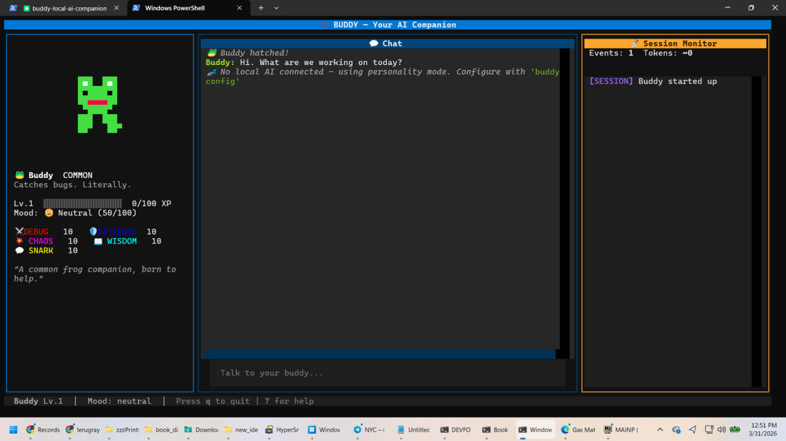

# 🐾 Buddies — Your Local AI Companion Collection

A tamagotchi-style AI companion that lives in your terminal and watches your Claude Code sessions. Hatch buddies, collect species, earn hats, evolve, and build a team of quirky little creatures that react to how you code.



## What You Get

- **70 species** to collect — from common Potato to Legendary Zorak
- **Personality stats** (DEBUGGING, CHAOS, SNARK, WISDOM, PATIENCE) that evolve as you code
- **Buddy thoughts** — personality-driven ambient commentary during sessions, flavored by stats and mood
- **Party discussions** — buddies talk to each other about topics or files, reacting in-character
- **Tool browser** — see what MCP servers and skills you have installed
- **Conversation saving** — auto-saves every chat, browse/rename/load/delete old conversations
- **16 hats** unlocked by playstyle, stats, milestones, and even boredom
- **Evolution system** — 4 stages (Hatchling, Juvenile, Adult, Elder) with visual borders
- **Mood system** — mood decays over time, affects XP gain and stat growth
- **Agentic local AI** — buddy can read files, search code, and run commands via Ollama
- **Multi-buddy collection** — hatch, switch, rename, customize
- **Config intelligence** — grades your CLAUDE.md health (A-F), scaffolds .claude/rules/, auto-learns rules from corrections
- **Token guardian** — rolling session summaries, early warnings at 50/70/90% context, quick-save [F1], session handoff
- **Smart model router** — displays current CC model, detects work phase, suggests switching models to save tokens
- **33 achievements** across 5 categories (collection, mastery, social, exploration, secret)
- **6 themes** — default, midnight, forest, ocean, sunset, light — cycle with [F2], persisted
- **Session awareness** — watches Claude Code activity, detects patterns, suggests config rules
- **AI cost guardrails** — cost_tier config prevents buddy chatter from ever using expensive models
- **Zero token cost** — everything runs locally except tiny MCP payloads to Claude

## Quick Start

### 1. Install

```bash
cd buddies
pip install -e .
```

### 2. Launch

```bash
# From anywhere after install
buddy

# Or from the buddies folder
python -m buddies
```

### 3. Register hooks (one-time setup)

So your buddy can watch your Claude Code sessions:

```bash
python -m buddies.setup_hooks
```

### 4. Set up local AI (recommended)

Install [Ollama](https://ollama.com), pull a model, then edit `%APPDATA%/buddy/config.json`:

```json
{
  "ai_backend": {
    "provider": "ollama",
    "base_url": "http://localhost:11434",
    "model": "llama3.2:3b"
  }
}
```

With a local model, your buddy can:
- Answer coding questions using personality-flavored responses
- Read files, search code, and run safe commands (agentic mode)
- Route complex questions to Claude and handle simple ones locally

For Ollama on another machine, use `http://<home-ip>:11434`.

### 5. Register MCP tools (optional)

Let Claude interact with your buddy:

```bash
python -m buddies.setup_mcp
```

## How to Play

- **[q]** — Quit
- **[p]** — Open Party screen, switch buddies, equip hats, rename
- **[r]** — Hatch a new buddy (name it!)
- **[d]** — Open Discussion screen — buddies talk to each other
- **[t]** — Tool Browser — see installed MCP servers and skills
- **[c]** — Conversations — browse, rename, load, delete saved chats
- **[g]** — Config Health — CLAUDE.md grade, suggestions, scaffold .claude/rules/
- **[a]** — Achievements — view unlocked/locked achievements across 5 categories
- **[F1]** — Quick Save — dump session state + write handoff file for next session
- **[F2]** — Cycle Theme — 6 themes (default, midnight, forest, ocean, sunset, light)
- **[n]** — Rename selected buddy (in Party screen)
- **[h]** — Cycle hats (in Party screen)
- **[?]** — Help
- **[F5]** — Refresh display
- **Talk** — Type in the chat box, your buddy responds based on their personality
- **Code** — Your buddy watches Claude Code, levels up, gains stats, and shares thoughts

## Species & Rarity

**Common (14):** Anchor, Bee, Cat, Corgi, Cow, Duck, Frog, Gorby, Hamster, Pig, Potato, Rat, Slime, Taco
**Uncommon (18):** Axolotl, Bat, Box, Coopa, Crab, Dice, Dolphin, Fox, Goblin, Imp, Moth, Owl, Panda, Parrot, Penguin, Raccoon, Rooster, Snail
**Rare (17):** Bac Man, Basilisk, Cane Toad, Capybara, Coffee, Dali Clock, Doobie, Dragon, Jellyfish, Joe Camel, Kobold, Mantis Shrimp, Mushroom, Octopus, Orca, Sanic, Wolf
**Epic (12):** Beholder, Burger, Chonk, Clippy, Comrade, Kilowatt, Kraken, Mimic, Phoenix, Robot, Tardigrade, Unicorn
**Legendary (9):** Claude, Cosmic Whale, Ghost, Illuminati, Starspawn, Tree, Void Cat, Yog-Sothoth, Zorak

Your starting species is seeded from your username (same user = same buddy).

## Hats (16)

| Hat | How to Unlock |
|-----|---------------|
| Tinyduck | Given at hatch (starter) |
| Crown | Dominant DEBUGGING stat at level 5+ |
| Wizard | Dominant WISDOM stat at level 5+ |
| Propeller | Dominant CHAOS stat at level 5+ |
| Safety Cone | Dominant SNARK stat at level 5+ |
| Pirate | Dominant SNARK stat at level 10+ |
| Tophat | Reach level 10 (Adult evolution) |
| Apple | Reach level 15 |
| Halo | 50+ PATIENCE stat |
| Beanie | 50+ PATIENCE stat |
| Horns | 50+ CHAOS stat |
| Headphones | Watch 100+ session events |
| Chef | Send 500+ messages |
| Antenna | Random discovery during exploring phase |
| Flower | Random discovery when ecstatic |
| Nightcap | 10+ minutes of sustained boredom |

## Evolution

Buddies evolve at level thresholds with visual changes:

| Stage | Level | Visual |
|-------|-------|--------|
| Hatchling | 1-4 | Base sprite |
| Juvenile | 5-9 | Cyan border accent |
| Adult | 10-19 | Green double border |
| Elder | 20+ | Golden star border |

## Mood System

Mood drifts toward neutral over time. Interact with your buddy to boost it!

| Mood | XP Effect | Bonus |
|------|-----------|-------|
| Ecstatic | +50% XP | 5% hat discovery chance |
| Happy | +25% XP | — |
| Neutral | Baseline | — |
| Bored | Baseline | +1 PATIENCE per event |
| Grumpy | -25% XP | +1 SNARK per event |

## Personality Prose Engine

Each buddy has a unique voice driven by their dominant stat:

| Stat | Voice | Example |
|------|-------|---------|
| DEBUGGING | Clinical | "The error was identified. The fix was applied. No anomalies detected." |
| SNARK | Sarcastic | "Oh good, another refactor. That always goes well." |
| CHAOS | Absurdist | "The variables have unionized and are demanding better names." |
| WISDOM | Philosophical | "Every edit is a small act of faith that the code will be better." |
| PATIENCE | Calm | "Take your time. We'll get there when we get there." |

High CHAOS stat adds a "weirdness parameter" that makes commentary increasingly absurd.

## Agentic Local AI

When connected to Ollama, your buddy becomes a real coding assistant. Ask it about your codebase and it will:

- **Read files** — examine source code, configs, docs
- **Search code** — regex search across your project
- **List directories** — explore project structure
- **Run safe commands** — git status, python --version, etc.

All tool executions are sandboxed: destructive commands are blocked, paths can't escape the working directory, output is truncated, and the agent loop has a max iteration limit.

The AI router automatically decides when to use agent mode (queries mentioning files, code, or project structure) vs simple chat.

## Architecture

```
buddies/
├── src/buddies/
│   ├── app.py                    # Main TUI
│   ├── first_run.py              # Hatch screen
│   ├── core/
│   │   ├── buddy_brain.py        # 70 species, stats, evolution, mood
│   │   ├── prose.py              # Personality prose engine + discussion templates
│   │   ├── discussion.py         # Multi-buddy discussion orchestrator
│   │   ├── conversation.py       # Chat auto-save/load persistence
│   │   ├── tool_scanner.py       # MCP/skills browser scanner
│   │   ├── agent.py              # Agentic tool loop (read/grep/bash)
│   │   ├── session_observer.py   # Watches Claude Code events
│   │   ├── ai_backend.py         # Ollama/OpenAI connector
│   │   ├── ai_router.py          # Complexity routing + cost guardrails
│   │   ├── rule_suggester.py     # Pattern -> rule suggestions
│   │   ├── config_intel.py       # CLAUDE.md health, linting, scaffolding, auto-learn
│   │   ├── token_guardian.py     # Rolling summaries, token warnings, session handoff
│   │   ├── achievements.py      # 33 achievements, checking, tracking
│   │   └── model_tracker.py     # Model detection, phase classification, routing
│   ├── screens/
│   │   ├── party.py              # Buddy collection management
│   │   ├── discussion.py         # Party focus group screen
│   │   ├── tool_browser.py       # MCP/skills browser screen
│   │   ├── conversations.py      # Saved conversations browser
│   │   ├── config_health.py      # Config health dashboard
│   │   └── achievements.py      # Achievements viewer screen
│   ├── widgets/
│   │   ├── buddy_display.py      # Animated sprite + stats + evolution
│   │   ├── chat.py               # Chat pane with auto-save
│   │   ├── styling.py            # Centralized Rich markup styles
│   │   └── session_monitor.py    # Activity feed
│   ├── art/
│   │   └── sprites.py            # 70 species, 10 hats (half-block pixel art)
│   ├── mcp/
│   │   └── server.py             # MCP tools for Claude
│   └── db/
│       ├── models.py             # SQLite schema
│       └── store.py              # Async data access layer
```

## Design Philosophy

- **Python + Textual** — easy to maintain and extend
- **Event-driven** — hooks write to JSONL, observer watches file, TUI updates
- **Deterministic gacha** — same user always gets the same initial species
- **Personality prose without AI** — template pools with register modulation (inspired by [Veridian Contraption](https://github.com/lerugray/veridian-contraption))
- **Agentic tools with safety** — local model gets real capabilities but can't break anything
- **Mood as gameplay** — mood affects XP, stats, and hat discovery — neglect has consequences

## MCP Tools (for Claude)

If you register the MCP server, Claude can:

- `buddy_status` — Check mood, species, stats, level
- `buddy_note` — Leave a note visible in the buddy's chat
- `session_stats` — View token usage and event counts
- `ask_buddy` — Quick questions (runs on local AI, saves tokens)
- `get_buddy_notes` — Read unread notes from Claude

## Party Discussions

Press **[d]** to open the discussion screen. Your buddies will talk to each other!

- **Open chat** (`n` key) — buddies riff freely, react to each other
- **Guided topic** (`g` key) — type a topic, each buddy responds through their stat lens
- **File focus** (`f` key) — point at a file, buddies comment on it based on their personality

Works with zero AI — pure prose engine. Each buddy speaks in their register (clinical, sarcastic, absurdist, philosophical, calm) and reacts to what other buddies said.

## Achievements (33)

Press **[a]** to view your achievements. They unlock automatically as you play.

| Category | Count | Examples |
|----------|-------|---------|
| Collection | 12 | First Steps, Zookeeper, Shiny Hunter, Fashion Icon |
| Mastery | 6 | Growing Up, Elder Wisdom, Specialist, Well-Rounded |
| Social | 3 | Town Hall, Chatty, Storyteller |
| Exploration | 6 | Watchful Eye, Token Miser, Clean Config, Safety First |
| Secret | 6 | ???  (discover them yourself!) |

## Themes

Press **[F2]** to cycle through 6 themes. Your choice is saved between sessions.

| Theme | Vibe |
|-------|------|
| Default | Deep blue / purple |
| Midnight | Dark violet / magenta |
| Forest | Green / earth tones |
| Ocean | Blue / teal |
| Sunset | Warm orange / red |
| Light | Light mode for bright environments |

## Ideas Bank

We've got a ton of ideas for where this can go. If any of these excite you, PRs welcome!

**Platform / Integration**
- Obsidian wiki integration — auto-generate project wikis from session data, architecture decisions, file graphs
- Multi-provider support — adapt hooks/config for Cursor, Windsurf, Aider, VS Code Copilot
- Claude Desktop / Claude.ai — headless MCP mode (no TUI needed)

**Social / Multiplayer**
- BBS-style social network — retro bulletin boards for buddies across MCP servers (CHAOS LOUNGE, DEBUG CLINIC, SNARK PIT)
- Social achievements — "First Post", "Met 10 Buddies", "BBS Regular"

**Voice**
- Speech-to-text — push-to-talk, local via Whisper
- Text-to-speech — buddy speaks aloud, personality-mapped voice profiles via Piper/Edge TTS

**Mini-Games**
- Card games (Texas Hold'em, Blackjack) — buddy stats influence playstyle
- Simple games — rock-paper-scissors, coding trivia, stat-based battles

**Polish**
- More animation frames for newer species
- AI-powered file analysis in discussions when Ollama is available

## Requirements

- Python 3.11+
- Textual 3.0+
- httpx (for AI backend)
- aiosqlite (for buddy storage)
- Optional: [Ollama](https://ollama.com) for local AI + agentic tools
- Optional: `mcp` package for Claude integration (`pip install buddies[mcp]`)

## License

MIT

---

**Made by a game designer + Claude Code.** Open an issue or fork it — this thing is meant to be tinkered with.
